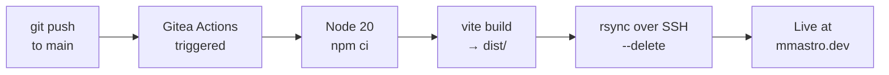
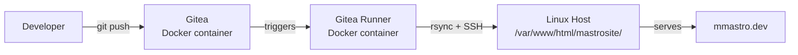

# mmastro.dev

This is the repo for my personal website. A mobile-first landing page for showcasing my portfolio. It uses the front-end tech stack I'm most comfortable with:


> [mmastro.dev](https://mmastro.dev) — self-hosted and auto-deployed.


<!-- Screenshot: save your image to the repo (e.g. public/assets/Images/preview.png) and uncomment the line below -->
<!--  -->

---

## Tech Stack

| Layer | Technology | Notes |
|---|---|---|
| UI | **React 18** | The framework I'm most familiar with. The functional components give a lot of flexibility and speed when developing a personal website and it's ever-changing requirements. |
| Language | **TypeScript 6** | For strict type definitions for type safety. I used inline interfaces for developer comfort on a small scale project. |
| Build | **Vite 5** | Modern, fast and easy to setup for a simple project like this. |
| Styling | **Tailwind CSS 4** | Perfect for a project at this scale, helps me prototype and modify quickly and elegantly the style across the entire website. Well adapted for mobile-first. |

---

## Architecture

A responsive multi-section SPA (Single Page Application): **horizontal scroll on desktop** (>1024px), **vertical scroll on mobile**. Four full-screen sections are rendered in a single scroll container: Hero, Projects, About, Connect.

```
src/
├── App.tsx                          # Root: scroll container + section refs
└── components/
    ├── Hero/
    │   ├── HeroPage/                # Hero panel: logo, name, nav buttons
    │   └── LogoIcon/                # Circular profile image
    ├── Navigation/
    │   ├── NavigationButton/        # href (link) or onClick (scroll) button
    │   └── NavigationButtonList/    # Maps a props array to buttons
    ├── Projects/
    │   ├── ProjectCard/             # Card with status badge, stack tags, links
    │   └── ProjectsSection/         # Responsive grid of project cards
    ├── About/
    │   └── AboutSection.tsx         # Bio, key facts, open-to-work badge
    ├── Connect/
    │   └── ConnectSection.tsx       # CTA link grid (email, LinkedIn, GitHub)
    ├── Badge/                       # Status indicator: live · in-dev · neutral
    ├── PageDots/                    # Fixed dot nav — synced to scroll position
    ├── ScrollDownIndicator/         # Mobile-only animated scroll hint
    └── Placeholder/                 # Dev placeholder for upcoming sections
```

Components use **barrel exports** (`index.ts`) and **inline type definitions** for clean imports and strict type safety. `NavigationButton` supports both `href` (external link) and `onClick` (smooth section scroll) via a props union. Project cards show full description on larger screens but adapt on mobile by hiding the details in modals that can be easily opened with a single tap.

---

## CI/CD Pipeline

Every push to `main` automatically builds and deploys the site via **Gitea Actions** without any manual intervention.



**Pipeline steps** ([`.gitea/workflows/deploy.yml`](.gitea/workflows/deploy.yml)):

1. **Checkout** — pull latest source
2. **Setup Node 20** — with npm dependency caching
3. **`npm ci`** — clean, reproducible install
4. **`npm run build`** — Vite produces an optimized `dist/` bundle
5. **Install rsync** — explicitly provisioned in the runner image (`apt-get install -y rsync`)
6. **`rsync --delete`** — atomically syncs `dist/` to the server; `ssh-keyscan` pre-populates `known_hosts` for unattended deploys
7. **SSH auth** — private key stored as the `SSH_PRIVATE_KEY_MASTROSITE` Gitea repository secret

---

## Infrastructure

The entire stack runs on a self-owned **bare-metal Linux server**.



- **Gitea** — self-hosted Git forge + Actions runtime, running as a Docker container
- **Gitea Runner** — containerized CI executor on the same host
- **rsync over SSH** — deploys only changed files to the web root

---

## Local Development

```bash
npm install       # install dependencies
npm run dev       # start dev server with hot module replacement
npm run build     # production build → dist/
npm run preview   # locally preview the production build
```

---

## License

[MIT](./LICENSE)