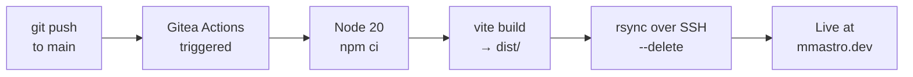
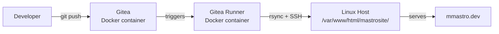

# mmastro.dev

This is the repo for my personal website. A mobile-first landing page for showcasing my portfolio. It uses the front-end tech stack I'm most comfortable with:


> [live link](https://mmastro.dev) — self-hosted and auto-deployed.


<!-- Screenshot: save your image to the repo (e.g. public/assets/Images/preview.png) and uncomment the line below -->
<!--  -->

---

## Tech Stack

| Layer | Technology | Notes |
|---|---|---|
| UI | **React 18** | The framework I've worked with the most and I'm most familiar with. The fucntional components give a lot of flexibility and speed when developing new parts in a site that are essential in a personal landing page that can be subject to frequent requirement change. |
| Language | **TypeScript 6** | For strict type definitions |
| Build | **Vite 5** | Modern, fast and easy to setup for a simple project like this. |
| Styling | **Tailwind CSS 4** | Perfect for a project at this scale, helps me prototype and modify quickly and elegantly the style across the entire website. Well adapted for mobile-first. |

---

## Architecture

A two-column single-page layout: a full-height cover image on the left and a centered content panel on the right.

```
src/
├── App.tsx
└── components/
    ├── Hero/
    │   └── LogoIcon/            # Cover image component (typed props)
    └── Navigation/
        ├── NavigationButton/    # Single link button
        └── NavigationButtonList # Maps a props array to buttons
```

Components use **barrel exports** (`index.ts`) and **co-located type definition files** (`.types.d.tsx`) for clean imports and strict type safety.

---

## CI/CD Pipeline

Every push to `main` automatically builds and deploys the site via **Gitea Actions** — no manual steps required.



**Pipeline steps** ([`.gitea/workflows/deploy.yml`](.gitea/workflows/deploy.yml)):

1. **Checkout** — pull latest source
2. **Setup Node 20** — with npm dependency caching
3. **`npm ci`** — clean, reproducible install
4. **`npm run build`** — Vite produces an optimized `dist/` bundle
5. **`rsync --delete`** — atomically syncs `dist/` to the server, removing stale files
6. **SSH auth** — private key stored as a Gitea repository secret

---

## Infrastructure

The entire stack runs on a **bare-metal Linux server** — no cloud provider involved.



- **Gitea** — self-hosted Git forge + Actions runtime, running as a Docker container
- **Gitea Runner** — containerized CI executor on the same host
- **rsync over SSH** — deploys only changed files to the web root

---

## Local Development

```bash
npm install       # install dependencies
npm run dev       # start dev server with hot module replacement
npm run build     # production build → dist/
npm run preview   # locally preview the production build
```

---

## License

[MIT](./LICENSE)